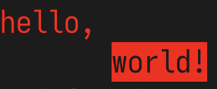

# ansi-to-pre

Convert a string of terminal output with ANSI escape codes into a
`<pre>` tag with styled spans (for putting in docs and web
pages), or a flattened `ANSI` string with normalized color codes
(for use with other ANSI-parsing programs that only support
colors but not control codes).

Colors are supported of course, but so is the full suite of
cursor motion, partial/full erasing, etc. Basically, everything
that [`ink`](https://github.com/vadimdemedes/ink) outputs, it
will resolve and turn into an HTML or flattened ANSI
representation.

## USAGE

```js
import { ansiToPre, ansiToAnsi } from 'ansi-to-pre'

// or however you get a colored ansi code string
import chalk from 'chalk'
const s = `
${chalk.red('red text')}
${chalk.blue('blue' + chalk.bold('bold'))}
`

console.log(ansiToPre(s))
/*
<pre style="background:#222222;color:#eeeeee;position:relative">
<span style="color:red">red text</span>
<span style="color:blue">blue</span><span style="color:blue;font-weight:bold">bold</span>
</pre>
*/
```

## Emoji Fixing

Emojis are tricky to work with in JavaScript! Sometimes a single
emoji glyph is one character wide, sometimes two, sometimes
something in between. Regardless of CSS line-height or font-size,
it might be taller than other characters in the line, causing
weird spacing that makes your HTML not look like a faithful
representation of the ANSI that printed to your terminal.

To address this irregularity, `ansiToPre` will replace all emoji
characters with an absolutely positioned `span`, nudged up
`0.3ex` from its default position, followed by 2 spaces. In my
testing, in most monospace fonts checked, this is about the best
way to make the emoji show up in the right place in the line,
with enough space to be shown fully. Occasionally, for narrower
emojis, this can result in some extra space, but that's usually
better than cutting them off or overlapping other characters.

## Default Styling

By default, there are colors assigned to the root `pre` tag and
the 16 basic ANSI colors, for a relatively basic dark theme.

To change the default colors or the theme, see the `theme()`
method (and others) described below.

## Hyperlinks

If there's a hyperlink in the ANSI string, using the OSC code
`\x1b]8;;<url>\x1b\`, then it will be turned into an `<a>` tag in
the HTML output.

You can also use `terminal.setStyle({ href: '...' })` to write
everything from that point forward as a hyperlink, and call
`.setStyle({ href: '' })` to stop writing in hyperlink mode.

## Why?

I needed a way to put the output from [tap](https://node-tap.org)
reports into the documentation, and wasn't able to find an
ANSI-to-HTML converter that handled the full set of cursor
movements, erases, scrolling, etc. that a complicated ink program
outputs. There are several that do colors, and a handful that do
the other text styling like bold and underline, but none that
handle cursor movement codes. So I was still doing a bunch of
manual editing of the files before converting the styles to css,
or cleaning up mochibake after conversion. No fun.

I called it `ansi-to-pre`, because dropping ANSI output into a
`<pre>` tag is my main use case, but you could conceivably do a
bunch of other interesting stuff with a virtual ANSI terminal, I
guess. You could even use the `Terminal` class as a sort of
`chalk` replacement that write to random places in the string of
output, but to be honest, `chalk` has a much nicer API for most
cases where you just want styled text, and `ink` is a better tool
for complicated "write stuff to the terminal" tasks.

## API

```
import {
  // main functions
  ansiToPre,
  ansiToAnsi,

  // classes
  Terminal,
  Block,
  Style,

  // other goodies
  theme,
  defaultColor,
  defaultBackground,
  nameCodes,
  codeNames,
  namedColors,
  namedBrightColors,
  xtermCode,
} from 'ansi-to-pre'
```

### `ansiToPre(ansi: string): string`

Turn an ANSI string into a styled HTML `<pre>` tag.

### `ansiToAnsi(ansi: string): string`

Resolve all control codes and return an ANSI color style
representation of the result.

### class `Terminal`

A representation of a virtual "terminal" screen where character
and style information as the ANSI-encoded stream is parsed.

Important: this is _not_ a full-fledged Stream class. You can
`write()` to it multiple times, and it will update appropriately,
but it does zero buffering or input validation, so writing a
partial ANSI code sequence will result in mochibake in the
output.

The virtual terminal is an infinitely high and wide screen, with
no scrollback buffer. So, when `scrollDown(n)` is called (either
explicitly, or with a `\x1b[<n>S` ANSI code), `n` lines are
removed from the top of the "screen". When `scrollUp(n)` is
called (explicitly or via a `\x1b[<n>T` ANSI code), `n` _empty_
lines are added to the top of the screen; the lines lost to a
previous `scrollDown` action are not restored when scrolling up.

Also, actions that move the cursor down or to the right, which
would on a normal physical terminal be limited to the
height/width of the terminal, are unbounded. For example, on an
actual terminal, `echo $'\x1b[1000Bhello'` will print "hello" at
the bottom of the screen (unless your screen happens to be more
than 1000 lines high); in this virtual terminal, it will create
1000 empty lines.

Most of the methods (other than `toString()` of course) return
`this`, allowing for things like this:

```js
console.log(
  new Terminal()
    .setStyle({ color: '#ff0000' })
    .write('hello, ')
    .down(1)
    .setStyle({ inverse: true })
    .write('world!').ansi,
)
```

Outputs:



#### `constructor(input?: string)`

Create a new `Terminal` instance. If provided, the string is
written immediately.

#### property `ansi: string`

A representation of the current state of the Terminal as a
normalized ANSI encoded string. All cursor codes resolved, and
colors normalized to `48;2;r;g;b` format.

#### property: `blocks: Block[]`

An array of `Block` objects each representing a string of text
with a given style.

#### `toString(): string`

Returns an HTML representation of the text and styles as a `pre`
tag with styled `span` children.

#### `write(input: string): Terminal`

Parse the ANSI encoded string provided, updating the internal
character and style buffers appropriately.

#### `setStyle(style: StyleProps | string): Terminal`

Set the style that the terminal will use for text writes.

If a string, must be a valid `\x1b[...m` and/or
`\x1b]8;;<url>\x1b\` ANSI code.

The styles provided will be appended onto the current style in
use, just as they would be by a real terminal if the relevant
ANSI code is encountered.

#### `up(n: number): Terminal`

Move the cursor up `n` lines, stopping at the top.

#### `down(n: number): Terminal`

Move the cursor down `n` lines, without limit.

#### `scrollUp(n: number): Terminal`

Prepend `n` empty lines at the start of the buffer, effectively
moving the cursor up as a result.

#### `scrollDown(n: number): Terminal`

Remove `n` lines from the start of the buffer, effectively moving
the cursor down as a result.

#### `forward(n): Terminal`

Move the cursor forward `n` columns, without limit.

#### `back(n): Terminal`

Move the cursor back `n` columns, stopping at the first column.

#### `nextLine(n): Terminal`

Move to the start of the `n`-th next line.

#### `prevLine(n): Terminal`

Move to the start of the `n`-th previous line, stopping at the
top of the screen.

#### `horizontalPosition(n): Terminal`

Move to the `n`-th column (1-indexed), limited by the left-most
column.

#### `position(row, column): Terminal`

Move to the 1-indexed row and column specified, limited by the
top and left sides of the screen.

#### `eraseScreen(): Terminal`

Delete all printed data from the screen.

Note that this is used for both `\x1b[2J` _and_ `\x1b[3J`,
because there is no scrollback buffer in this virtual terminal.

#### `eraseScreenToEnd(): Terminal`

Delete all printed data from the cursor to the end of the screen.

#### `eraseScreenFromStart(): Terminal`

Delete all printed data from the top of the screen to the cursor.

#### `eraseLine(): Terminal`

Delete the contents of the current line.

#### `eraseLineToEnd(): Terminal`

Delete printed data from the cursor to the end of the current
line.

#### `eraseLineFromStart(): Terminal

Delete printed data from the start of the current line to the
cursor.

### class `Block`

A representation of a run of text in a given style.

#### `write(text): Block`

Append text to the block

#### property `ansi` (read-only)

A representation of the block as an ANSI styled string.

#### property `text` (read-only)

The unstyled text that will be written.

#### property `style` (read-only)

The Style object for this block of text.

### class `Style`

An immutable representation of an ANSI style. Used by Terminal
and Block to represent the styles in use for text to be printed.

If a Style object is created with the same properties as a
formerly seen Style object, the same object will be returned.

For example:

```js
const a = new Style({ bold: true })
const b = new Style({ bold: true })
assert.equal(a, b) // passes
```

This optimization cuts down considerably on object creation,
because a Style is created for each styled character written to
the Terminal buffer. It also means that Style objects can be
compared directly with `===` to test for equivalence.

#### static `propertiesAnsi(styles): string`

Convert a set of properties to an ANSI style code

#### static `ansiProperties(styles): string`

Convert an ANSI style code to a set of properties

#### `update(properties: Style | string): Style`

Return a new Style with this one plus the updated properties.

If a string is provided, must be a valid `\x1b[...m` ANSI style
code, though unrecognized properties within that code will be
ignored rather than throwing an error.

#### `toString(): string`

A CSS string corresponding to the style properties set.

#### property `isReset: boolean`

True if this style is a full reset of all properties.

#### property `ansi: string`

A `\x1b[...m` ANSI code corresponding to this style.

### `defaultBackground(s?: string): string`, `defaultColor(s?: string): string`

The hex codes set on the `<pre>` for `background` and `color`,
and used as the "unstyled" colors.

Call with a string to change the color used.

### type `Names`

Canonical names for the 8 standard colors.

### type `Theme`

```ts
export type Theme = {
  defaultColor?: string
  defaultBackground?: string
  named?: { [name in Names]?: string }
  bright?: { [name in Names]?: string }
}
```

A representation of the theme used for the default color and
background, 8 standard colors, and 8 bright variants.

### `theme: (t?: Theme): Theme`

Call to get or set the color theme for the default color and
background, 8 standard colors, and 8 bright variants.

Returns the theme in use.

For example:

```js
import { theme } from 'ansi-to-pre'

// solarized dark with full-saturation brights
theme({
  defaultColor: '#000000',
  defaultBackground: '#eee8d5',
  // https://en.wikipedia.org/wiki/Solarized#Colors
  named: {
    black: '#002b36',
    red: '#dc322f',
    green: '#859900',
    yellow: '#b58900',
    blue: '#268bd2',
    magenta: '#d33682',
    cyan: '#2aa198',
    white: '#fdf6e3',
  },
  bright: {
    black: '#586e75',
    red: '#ff0000',
    green: '#00ff00',
    yellow: '#ffff00',
    blue: '#0000ff',
    magenta: '#ff00ff',
    cyan: '#00ffff',
    white: '#ffffff',
  },
})
```

### `nameCodes: { [name in Names]: NameCodes }`

Mapping of the named colors to their ANSI bitwise `grb` numeric
color codes. For example, `nameCodes.black === 0`.

### `codeNames: Names[]`

A mapping of the codes 0-7 to their canonical names. For example,
`codeNames[0] === 'black'`.

### `namedColors: string[]`

Mapping of the named color codes to their HEX color
represenations. May be modified to change theme.

### `namedBrightColors: string[]`

Mapping of named color codes to the HEX color represenataions of
their bright variants. May be modified to change theme.

This array may be modified to change the color scheme.

### `xtermCode: (n: number): string`

Get the HEX code for an XTerm color code between 0 and 255. May
be modified to change theme.
